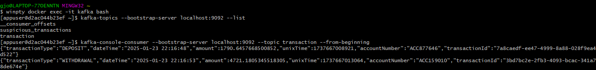
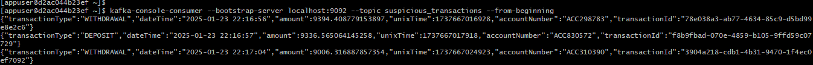
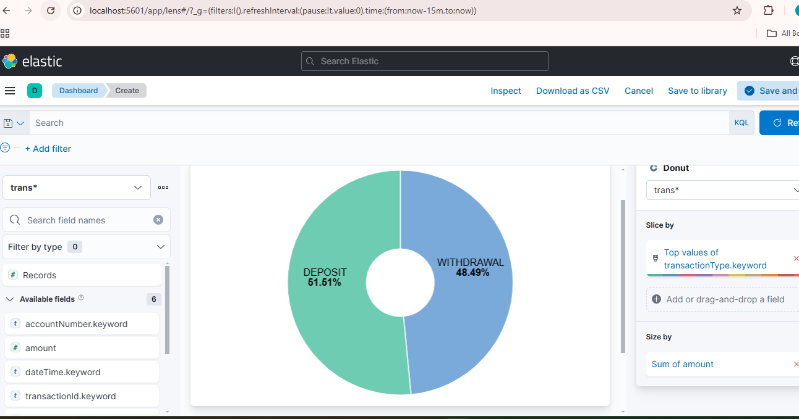

# Microservice and Kafka-Based Transaction Processing System

## Overview
This project demonstrates a Kafka-based microservices architecture designed for processing financial transactions. The components include:
- **TransactionGeneratorService [Service A]**:  
  - Message producer Service.
  - This microservice acts as **ServiceA** which generates random financial transactions [at the rate 1/sec] and publishes them to a Kafka topic.
- **TransactionConsumingService [Service B]**:  
  - Message Consumer Service. 
  - This microservice acts as **ServiceB** which Consumes transactions from Kafka, ingests them into Elasticsearch, and enables the log monitoring  in Kibana.
- **FraudDetectionService[An enhancement one]**: 
  - This is a kafka streams class which will helps in detecting fraudulent transaction and will insert it to a separate topic.

## Technologies Used
- **Programming Language**: Java 
- **Message Broker**: Apache Kafka
- **Stream Processing**: Kafka Streams API
- **Framework**: Spring Boot (for  microservice development)
- **Log Storage**: Elastic stack


## Running the Project
1. **Start the services**:
    - `docker-compose up -d`
    - Kafka Bootstrap Server port - 9092
    -  Elasticsearch will be hosted on `http://localhost:9200`
    -  Kibana will be hosted on `http://localhost:5601`

2. **Build the Project**:
   ```bash
   mvn clean install
   mvn spring-boot:run -Dspring-boot.run.main-class=com.DanB.TransactionGeneratorService #This starts Service - A and B and will start ingesting logs to elastic.
   mvn exec:java -Dexec.mainClass=com.DanB.TransactionGeneratorService #This starts kafka- Streaming
   ```
   
3. **View Transactions in Kibana**:
    - Navigate to Kibana using url `http://localhost:5601`
    - Create an index pattern for `transactions`.

## To see Kafka topics
Run the following commands to create the necessary topics:
```bash
winpty docker exec -it kafka bash #if using windows/gitbash
kafka-topics --bootstrap-server localhost:9092 --list
kafka-console-consumer --bootstrap-server localhost:9092 --topic transaction --from-beginning
kafka-console-consumer --bootstrap-server localhost:9092 --topic suspicious_transactions --from-beginning
```





## Example Transaction Data
A typical transaction looks like this:
```json
{
  "transactionId": "123e4567-e89b-12d3-a456-426614174000",
  "accountNumber": "ACC123456",
  "amount": 12000.50,
  "transactionType": "DEPOSIT",
  "unixTime": 1737629586625,
  "dateTime": "2025-01-24 10:00:00"
}
```

## Testing
1. -  Unit Tests

Unit test is added to test the core functionalities which can be run by 
```aiignore
mvn test 
```
The test uses the below components:
- `Mockito`: For mocking the `KafkaTemplate`.
- `ArgumentCaptor`: To capture and validate the arguments passed to the `send` method.


2. - Kafka Consumer Performance Test Script

The below script will test the performance based on the number of messages consumed
#### Usage:
```bash
./kafka_performance_test.sh
```

## Kibana Visualization
- This plot provides the real time debit/Credit percentage values
 

## Future Possible Enhancements
- Implement authentication and authorization for the microservices.
- Scale services dynamically using Kubernetes.